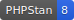

[](workbench/resources/md/svg/coverage.svg)
[](workbench/resources/md/svg/phpstan.svg)
[](https://packagist.org/packages/schenke-io/packaging-tools)
[](https://packagist.org/packages/schenke-io/packaging-tools)
[](https://github.com/schenke-io/packaging-tools/actions/workflows/run-tests.yml)
[](https://github.com/schenke-io/packaging-tools/blob/main/LICENSE.md)
[](https://packagist.org/packages/schenke-io/packaging-tools)

<!--
********************************************************************************
*                                                                              *
*     DO NOT EDIT THIS FILE MANUALLY! IT WILL BE OVERWRITTEN.                  *
*                                                                              *
*     This file was generated by: workbench/MakeMarkdown.php
*     Source files are located in: workbench/resources/md
*
*     If you want to change the content, edit the source files instead.        *
*                                                                              *
********************************************************************************
-->
# Packaging Tools

> Tools to simplify publishing github packages


This package is a collection of tools to simplify the package and project development.

The main elements are:
- **Markdown** Assemble the readme.md file out of small markdown files, class comments and other sources
- **Badge** build the badge custom or from existing files
- **Setup** read the `.packaging-tools.neon` configuration file and modify scripts in `composer.json`
- **Boost Skills & Guidelines** this package supports the [Laravel Boost](https://laravel.com/docs/12.x/boost) standard for AI-ready packages.

### Skill-based documentation

Documentation for this package is partly generated from **AI Skills**. These skills are small, focused pieces of documentation that describe specific features or workflows. They are located in `resources/boost/skills/` and are also compatible with Laravel Boost.

By using these skills, the package ensures that both human developers and AI assistants have clear, actionable instructions on how to use the provided tools.

* [Packaging Tools](#packaging-tools)
    * [Skill-based documentation](#skill-based-documentation)
  * [Badges System](#badges-system)
    * [Usage](#usage)
    * [Supported Badge Types (BadgeType Enum)](#supported-badge-types-badgetype-enum)
    * [Special Badges](#special-badges)
      * [Laravel Forge](#laravel-forge)
    * [Customization](#customization)
* [AI Guidelines and Skills for Boost](#ai-guidelines-and-skills-for-boost)
  * [When to use this skill](#when-to-use-this-skill)
  * [AI Guidelines](#ai-guidelines)
    * [Example `core.blade.php`](#example-core-blade-php)
  * [Package Name](#package-name)
    * [Features](#features)
  * [AI Skills](#ai-skills)
    * [Example `SKILL.md`](#example-skill-md)
* [Package Name Development](#package-name-development)
  * [When to use this skill](#when-to-use-this-skill)
  * [Features](#features)
  * [Database Migrations](#database-migrations)
    * [Usage](#usage)
    * [Process](#process)
    * [Workbench Support](#workbench-support)
    * [Model Discovery](#model-discovery)
  * [Migrations Trait](#migrations-trait)
    * [Usage](#usage)
  * [Markdown Assembler](#markdown-assembler)
    * [Usage in a Script](#usage-in-a-script)
    * [Commands and Purpose](#commands-and-purpose)
      * [Assembler Methods](#assembler-methods)
      * [Badges: `badges()`](#badges-badges)
      * [Classes: `classes()`](#classes-classes)
      * [Tables: `tables()`](#tables-tables)
      * [Table of Contents: `toc()`](#table-of-contents-toc)
  * [Installation](#installation)
  * [Concept](#concept)
  * [Configuration](#configuration)
    * [Initialization](#initialization)
    * [Configuration Keys](#configuration-keys)
    * [Detailed Key Purpose](#detailed-key-purpose)
      * [`analyse`](#analyse)
      * [`coverage`](#coverage)
      * [`infection`](#infection)
      * [`markdown`](#markdown)
      * [`migrations`](#migrations)
      * [`pint`](#pint)
      * [`quick`](#quick)
      * [`release`](#release)
      * [`sql-cache`](#sql-cache)
      * [`test`](#test)
      * [`customTasks`](#customtasks)
    * [Schema Validation](#schema-validation)
  * [Seeding Trait](#seeding-trait)
    * [Usage](#usage)
    * [MarkdownAssembler](#markdownassembler)
      * [How to assemble a markdown](#how-to-assemble-a-markdown)
        * [Bootstrapping](#bootstrapping)
        * [Assembly Example](#assembly-example)
        * [Key Methods](#key-methods)
      * [Public methods of MarkdownAssembler](#public-methods-of-markdownassembler)
    * [MakeBadge](#makebadge)
      * [Public methods of MakeBadge](#public-methods-of-makebadge)
    * [Config](#config)
      * [Public methods of Config](#public-methods-of-config)

| Title                                                                               | Description                                                                  |
|-------------------------------------------------------------------------------------|------------------------------------------------------------------------------|
| [Dynamic SVG Badges](resources/boost/skills/badges/SKILL.md)                        | Generate SVG badges for project metrics                                      |
| [AI-Ready Boost Guidelines](resources/boost/skills/guidelines/SKILL.md)             | Write AI guidelines and skills for projects based on Laravel Boost standards |
| [Elegant Migration Management](resources/boost/skills/imported-migrations/SKILL.md) | Clean up and manage database migrations                                      |
| [Modular Markdown Assembler](resources/boost/skills/markdown-assembly/SKILL.md)     | Assemble modular documentation and class references                          |
| [Swift Project Setup](resources/boost/skills/setup/SKILL.md)                        | Basic installation and configuration                                         |
| [Turbo Speed Seeding](resources/boost/skills/speed-seeding/SKILL.md)                | Speeds up database preparation in tests by loading a pre-generated SQL dump  |

## Badges System

The badges system allows for automatic generation of SVGs for various project metrics. It supports a wide range of built-in drivers and can be easily extended.

### Usage

Run the following command to generate all detected badges:

```bash
composer setup badges
```

Alternatively, you can call it from PHP:

```php
use SchenkeIo\PackagingTools\Badges\MakeBadge;

MakeBadge::auto();

// generate specific badges with auto-detected paths:
MakeBadge::makeCoverageBadge();
MakeBadge::makePhpStanBadge();
MakeBadge::makeInfectionBadge();
MakeBadge::makePhpVersionBadge();

// or with explicit paths:
MakeBadge::makeCoverageBadge('path/to/clover.xml');
MakeBadge::makePhpStanBadge('path/to/phpstan.neon');
MakeBadge::makeInfectionBadge('path/to/infection-report.json');
```

The `auto()` method iterates through all supported badge types and attempts to detect the necessary source files or configurations automatically.

### Supported Badge Types (BadgeType Enum)

The `BadgeType` Enum defines the badges that can be automatically detected and generated:

- **Coverage**: Displays the code coverage percentage. Detected from `clover.xml` (location found via `phpunit.xml`).
- **PhpStan**: Displays the PHPStan analysis level or status. Detected from `phpstan.neon` or `phpstan.neon.dist`.
- **Infection**: Displays the mutation score. Detected from `infection-report.json`.
- **PHP**: Displays the minimum PHP version requirement parsed from `composer.json`.
- **Version**: Displays the latest stable version from Packagist (via shields.io).
- **Downloads**: Displays the total number of downloads from Packagist (via shields.io).
- **Laravel**: Displays the minimum Laravel version requirement parsed from `composer.json`.
- **Tests**: Displays the GitHub Action workflow status (e.g., for "run-tests") (via shields.io).
- **License**: Displays the project license (via shields.io).

### Special Badges

#### Laravel Forge

The **Forge** badge is not included in the `BadgeType` enum because it requires specific parameters that cannot be automatically detected. It can be added via the Markdown Assembler:

```php
$assembler->badges()->forge(
    hash: 'your-hash',
    server: 123456,
    site: 654321,
    date: 1, // show date
    label: 1 // show label
);
```

### Customization

You can also define custom badges:

```php
use SchenkeIo\PackagingTools\Badges\MakeBadge;

MakeBadge::define('My Subject', 'Success', '27AE60')
    ->store('resources/md/svg/my-badge.svg');
```

# AI Guidelines and Skills for Boost

## When to use this skill
Use this skill when you need to create or update AI guidelines or skills for a Laravel package to make it "Boost-compatible".

## AI Guidelines

To include AI guidelines for a package, add a `resources/boost/guidelines/core.blade.php` file to your package. When users of your package run `php artisan boost:install`, Boost will automatically load your guidelines.

AI guidelines should provide a short overview of what your package does, outline any required file structure or conventions, and explain how to create or use its main features (with example commands or code snippets). Keep them concise, actionable, and focused on best practices so AI can generate correct code for your users.

### Example `core.blade.php`

```php
## Package Name

This package provides [brief description of functionality].

### Features

- Feature 1: [clear & short description].
- Feature 2: [clear & short description]. Example usage:

```php
$result = PackageName::featureTwo($param1, $param2);
```
```

## AI Skills

To include skills for a third-party package, add a `resources/boost/skills/{skill-name}/SKILL.md` file to your package. When users of your package run `php artisan boost:install`, Boost will automatically install your skills based on user preference.

Boost Skills support the [Agent Skills format](https://agentskills.io/what-are-skills) and should be structured as a folder containing a `SKILL.md` file with YAML frontmatter and Markdown instructions. The `SKILL.md` file must include required frontmatter (`name` and `description`) and can optionally include scripts, templates, and reference materials.

Skills should outline any required file structure or conventions, and explain how to create or use its main features (with example commands or code snippets). Keep them concise, actionable, and focused on best practices so AI can generate correct code for your users.

### Example `SKILL.md`

```markdown
---
name: package-name-development
description: Build and work with PackageName features, including components and workflows.
---

# Package Name Development

## When to use this skill
Use this skill when working with PackageName features...

## Features

- Feature 1: [clear & short description].
- Feature 2: [clear & short description]. Example usage:

$result = PackageName::featureTwo($param1, $param2);
```

## Database Migrations

The migrations component helps you keep your package's migrations in sync with your development database. It leverages `kitloong/laravel-migrations-generator` to regenerate migrations from an existing database schema.

### Usage

Run the following command to start the migration regeneration:

```bash
composer migrations
```

### Process

1. **Check for Generator**: The tool verifies if `kitloong/laravel-migrations-generator` is installed.
2. **Connection Selection**: The tool uses the source connection configured in `.packaging-tools.neon` or defaults to your primary database connection.
3. **Cleanup**: Existing migrations in the migrations folder will be deleted to ensure a clean state.
4. **Regeneration**: New migrations are generated from the selected database connection.
5. **Permissions**: Generated migration files are set to read-only (mode 444) to prevent accidental manual edits, encouraging the "database-first" approach for packages.

### Workbench Support

If you are using a workbench for package development, the tool automatically detects and uses `workbench/database/migrations` if it exists.

### Model Discovery

When using `connection:*` or when no tables are explicitly defined, the tool automatically scans for Eloquent models in the following directories (in order of priority):

1. `workbench/app/Models`
2. `app/Models`
3. `src/Models`

If none of these directories exist, a `PackagingToolException` is thrown to ensure the process does not proceed with incomplete information.

## Migrations Trait

This trait is intended for use within an Artisan command. It automates the generation and cleaning of package migrations by reverse-engineering your database schema.

### Usage

```php
use SchenkeIo\PackagingTools\Traits\GeneratesPackageMigrations;
use Illuminate\Console\Command;

class MyMigrationCommand extends Command
{
    use GeneratesPackageMigrations;

    public function handle()
    {
        $this->generatePackageMigrations();
    }
}
```

- **Auto-detection:** It automatically detects models and their associated tables based on your configuration.
- **Cleaning:** It removes environment-specific connection calls from the generated migrations to ensure they are portable.
- **Consistency:** It ensures standard Laravel system tables are included as a base.

## Markdown Assembler

The Markdown Assembler allows you to build complex Markdown files (like your README.md) from multiple components and source files.

### Usage in a Script

The tool is typically used in a `MakeMarkdown` script. You can generate a boilerplate script using:

```bash
// This is usually part of the automated setup
```

Example of an assembler script:

```php
use SchenkeIo\PackagingTools\Markdown\MarkdownAssembler;

$assembler = new MarkdownAssembler('resources/md');
$assembler->addTableOfContents()
    ->addMarkdown('header.md')
    ->badges()->all()
    ->addMarkdown('installation.md')
    ->addMarkdown('usage.md')
    ->classes()->all()
    ->writeMarkdown('README.md');
```

### Commands and Purpose

#### Assembler Methods

- `autoHeader()`: Adds a default header block based on project information.
- `skipWrittenBy()`: Skips the "DO NOT EDIT" warning and the footer "Markdown file generated by..." in the output file.
- `addMarkdown(string $filepath)`: Includes a markdown file from the source directory.
- `addTableOfContents()`: Adds a placeholder for the Table of Contents.
- `addText(string $content)`: Adds raw markdown text directly.
- `addContentProvider(MarkdownPieceInterface $provider)`: Adds a custom component that implements the `MarkdownPieceInterface`.
- `image(string $text, string $path, string $url)`: Adds an image with alt text, local path, and optional link URL.
- `writeMarkdown(string $filepath)`: Finalizes the assembly and writes the content to the specified file.

#### Badges: `badges()`

Returns a `Badges` component for adding project badges.

- `all()`: Adds all automatically detected badges (Version, Test, Downloads, Coverage, etc.).
- `version(BadgeStyle $badgeStyle)`: Adds a version badge from Packagist.
- `test(string $workflowFile, BadgeStyle $badgeStyle, string $branch = 'main')`: Adds a GitHub Actions test status badge.
- `download(BadgeStyle $badgeStyle)`: Adds a total downloads badge from Packagist.
- `php(BadgeStyle $badgeStyle)`: Adds a PHP version requirement badge.
- `local(string $text, string $path)`: Adds a link to a local SVG file.
- `forge(string $hash, int $server, int $site, int $date = 1, int $label = 1, BadgeStyle $badgeStyle = BadgeStyle::FlatSquare)`: Adds a Laravel Forge deployment status badge.

#### Classes: `classes()`

Returns a `Classes` component for documenting PHP classes.

- `all()`: Automatically documents all classes found in the `src/` directory.
- `add(string $classname)`: Documents a single class by its fully qualified name.
- `glob(string $pattern)`: Documents all classes matching a file pattern (e.g., `src/Models/*.php`).
- `custom(string $classname, Closure $callback)`: Documents a class using a custom rendering callback.

#### Tables: `tables()`

Returns a `Tables` component for creating Markdown tables.

- `fromFile(string $filepath)`: Reads table data from a CSV, TSV, or PSV file.
- `fromCsvString(string $csv, string $delimiter)`: Parses table data from a formatted string.
- `fromArray(array $data)`: Builds a table directly from a PHP array.

#### Table of Contents: `toc()`

Returns a `TOC` component for generating a linked Table of Contents.

## Installation

Install the package with composer:

```bash
  composer require schenke-io/packaging-tools
```

Add the setup command into `composer.json` under scripts.

```json
{
    "scripts": {
        "setup": "SchenkeIo\\PackagingTools\\Setup::handle"
    }
}
```

Start the setup:

```bash
  composer setup
```

or initialize the configuration:

```bash
  composer setup config
```

## Concept

This package follows the following concept:

- setup and configuration is controlled by a config file
- manual edits have higher priority than automatics
- when manual edits would be overwritten there is a warning
- the documentation is organised out of components which get assembled at the end
- important classes and methods are marked and documented
- badges are written from data
- the build process is controlled by script
- missing files are explained with full path

## Configuration

The package is configured via a `.packaging-tools.neon` file in your project root. This file uses the [NEON](https://ne-on.org/) format, which is similar to YAML but provides stronger schema validation and is ideal for configuration.

### Initialization

To create or sync your configuration file:

```bash
composer setup config
```

### Configuration Keys

The following keys are supported in `.packaging-tools.neon`:

| Key | Type | Purpose | Example |
|---|---|---|---|
| `analyse` | `bool` | Enables PHPStan static analysis | `analyse: true` |
| `coverage` | `bool` | Enables code coverage reporting during tests | `coverage: true` |
| `infection` | `bool` | Enables mutation testing with Infection | `infection: true` |
| `markdown` | `string\|null` | The command to run for Markdown assembly | `markdown: php workbench/MakeMarkdown.php` |
| `migrations` | `string\|null` | Configuration for migration generation | `migrations: mysql:*` |
| `pint` | `bool` | Enables code styling with Laravel Pint | `pint: true` |
| `quick` | `array` | Group task: `pint`, `test`, `markdown` | `quick: [pint, test, markdown]` |
| `release` | `array` | Group task for pre-release checks | `release: [pint, analyse, coverage, markdown]` |
| `sql-cache` | `bool|string|null` | Enables SQL caching for tests | `sql-cache: true` |
| `test` | `string` | Test runner: `pest`, `phpunit` or `''` | `test: pest` |
| `customTasks`| `array` | Mapping of custom task names to commands | `customTasks: { my-task: "ls -la" }` |

### Detailed Key Purpose

#### `analyse`

Runs PHPStan to perform static analysis on your codebase. It automatically detects if you are using standard PHP or Laravel (Larastan).

#### `coverage`

Requires a test runner to be configured. It adds coverage flags to the test command and checks for the existence of `clover.xml`.

#### `infection`

Runs mutation testing to check the quality of your tests. Requires `infection/infection` to be installed.

#### `markdown`

Points to the script that assembles your documentation. Usually `php workbench/MakeMarkdown.php`. Use `null` to disable.

#### `migrations`

Uses `kitloong/laravel-migrations-generator`. Can be a string in the format `connection:table1,table2`. Use `connection:*` to auto-detect tables from your models. Use `null` to disable.

#### `pint`

Uses Laravel Pint to ensure your code follows the project's styling rules.

#### `quick`

A shortcut to run essential checks quickly. By default it runs `pint`, `test` and `markdown`. You can override the list of tasks by providing an array.

#### `release`

A comprehensive check before releasing a new version. It typically runs `pint`, `analyse`, `test`, `coverage`, `infection` and `markdown`.

#### `sql-cache`

Dumps the current SQLite database to an SQL file (default `tests/Data/seeded.sql`). This can be loaded in tests using the `LoadsSeededSql` trait to significantly speed up database preparation. Can be `true` (default path), a `string` (custom path), or `null` (disabled).

> **Note:** To maintain the previous grouped behavior of running migrations and then sql-cache, you can add `@sql-cache` to your custom build commands or scripts.

#### `test`

Selects the testing framework. Supported values are `pest` and `phpunit`. Use an empty string `''` to disable tests.

#### `customTasks`

Allows you to define your own tasks that can be run via `composer setup <task-name>`.

### Schema Validation

All tasks in `packaging-tools` define their own configuration schema using `nette/schema`. This ensures that your configuration is always valid and provides helpful error messages if something is misconfigured.

## Seeding Trait

This trait is designed for testing environments to speed up database preparation. Instead of running all migrations and seeders for every test, you can load a pre-generated SQL dump.

### Usage

```php
use SchenkeIo\PackagingTools\Traits\LoadsSeededSql;
use Tests\TestCase;

class MyFeatureTest extends TestCase
{
    use LoadsSeededSql;

    public function setUp(): void
    {
        parent::setUp();
        $this->loadSeededSql();
    }
}
```

- **Speed:** Significantly faster than standard migrations and seeders in CI environments.
- **Ease of use:** Simply call `loadSeededSql()` in your test's `setUp` method.
- **Smart Loading:** It checks if the database is already seeded (e.g., by checking for the `users` table) before loading the SQL file to avoid redundant operations.

| key        | description                                                                                                  |
|------------|--------------------------------------------------------------------------------------------------------------|
| analyse    | false = disabled, true = enabled (uses phpstan/phpstan-phpunit or larastan/larastan)                         |
| coverage   | false = disabled, true = enabled (adds --coverage to the test runner)                                        |
| infection  | false = disabled, true = enabled (requires infection/infection)                                              |
| markdown   | null = disabled, string = enabled (command to assemble Markdown files)                                       |
| migrations | null = disabled, connection:* = auto-detect, connection:table1,table2 = enabled (with connection and tables) |
| pint       | false = disabled, true = enabled (uses laravel/pint)                                                         |
| quick      | an array of scripts to include in this group: pint, test, markdown                                           |
| release    | an array of scripts to include in this group: pint, analyse, test, coverage, infection, markdown             |
| sql-cache  | null = disabled, true = default path, 'path/to/file.sql' = custom path                                       |
| test       | '' = disabled, 'pest' or 'phpunit' = enabled                                                                 |

### MarkdownAssembler

Core engine for assembling Markdown documentation.


#### How to assemble a markdown

To assemble a markdown you need:
- a directory with markdown source files (e.g., `workbench/resources/md`)
- an assembly script (e.g., `workbench/MakeMarkdown.php`)

The `MarkdownAssembler` helps you combine static markdown files with dynamically generated content like badges, tables, and class documentation.

##### Bootstrapping

You can initialize a markdown directory with standard files:

```php
use SchenkeIo\PackagingTools\Markdown\MarkdownAssembler;

MarkdownAssembler::init('workbench/resources/md');
```

##### Assembly Example

```php
<?php

require "vendor/autoload.php";

use SchenkeIo\PackagingTools\Markdown\MarkdownAssembler;

try {
    $mda = new MarkdownAssembler('workbench/resources/md');

    // add a header with project name, description and badges
    $mda->autoHeader('My Awesome Package');

    // include a static file from the markdown directory
    $mda->addMarkdown("introduction.md");

    // add a Table of Contents for all headings in the final document
    $mda->toc();

    // add a table with all skills, their descriptions and links
    $mda->skillOverview();

    // add all skills from resources/boost/skills/
    $mda->skills()->all();

    // add a table from a CSV file
    $mda->tables()->fromFile('data.csv');

    // add documentation for all classes in src/
    $mda->classes()->all();

    // or from a single class
    $mda->classes()->add(MarkdownAssembler::class);

    // write the result to a file (relative to root directory)
    $mda->writeMarkdown("README.md");

} catch (Exception $e) {
    echo "ERROR: " . $e->getMessage() . PHP_EOL;
}
```

##### Key Methods

- `autoHeader(?string $title)`: Adds project title, description, and common badges.
- `addMarkdown(string $filename)`: Includes a file from the source directory.
- `addText(string $text)`: Appends raw markdown text.
- `toc()`: Inserts a Table of Contents.
- `skillOverview()`: Adds a table with all skills, their descriptions and links.
- `skills()`: Accesses the Skills piece for including feature documentation.
- `tables()`: Accesses the Tables piece for creating markdown tables from arrays, CSV strings, or files.
- `classes()`: Accesses the Classes piece for generating documentation from PHP classes using reflection.
- `badges()`: Accesses the Badges piece for adding custom badges.
- `writeMarkdown(string $filename)`: Finalizes and writes the assembled markdown to the specified path.

#### Public methods of MarkdownAssembler

| method             | summary                                                    |
|--------------------|------------------------------------------------------------|
| init               | -                                                          |
| skipWrittenBy      | -                                                          |
| autoHeader         | -                                                          |
| addMarkdown        | Adds a markdown file.                                      |
| addTableOfContents | add a table of content for the full file                   |
| addText            | adds markdown text                                         |
| addContentProvider | -                                                          |
| badges             | -                                                          |
| classes            | -                                                          |
| tables             | -                                                          |
| toc                | -                                                          |
| skills             | -                                                          |
| skillOverview      | Add a table with all skills, their descriptions and links. |
| image              | -                                                          |
| writeMarkdown      | writes all added elements into one file                    |

### MakeBadge

Central class for generating and storing SVG badges.

#### Public methods of MakeBadge

| method              | summary                                                      |
|---------------------|--------------------------------------------------------------|
| auto                | Automatically detect and generate all supported badge types. |
| define              | Create a new MakeBadge instance with manual definitions.     |
| fromDriver          | Create a new MakeBadge instance using a driver.              |
| makeCoverageBadge   | Create a coverage badge from a clover.xml file.              |
| makePhpStanBadge    | Create a PHPStan badge from a neon configuration file.       |
| makeInfectionBadge  | Create an Infection badge from a JSON report.                |
| makePhpVersionBadge | Create a PHP version badge from composer.json.               |
| info                | Get the informational summary string for the badge.          |
| store               | Generate the SVG and store it in a file.                     |

### Config

Handles the configuration for the packaging tools.

#### Public methods of Config

| method          | summary                                                                  |
|-----------------|--------------------------------------------------------------------------|
| getMarkdownDir  | returns the directory where Markdown source files are located            |
| output          | outputs a message to the console unless silent mode is active            |
| doConfiguration | Entry point for configuration updates                                    |
| getC2pDeltas    | returns a list of deltas from composer.json to configuration             |
| writeConfig     | writes a default configuration file if it doesn't exist or merges deltas |


---

Markdown file generated by [schenke-io/packaging-tools](https://github.com/schenke-io/packaging-tools)
