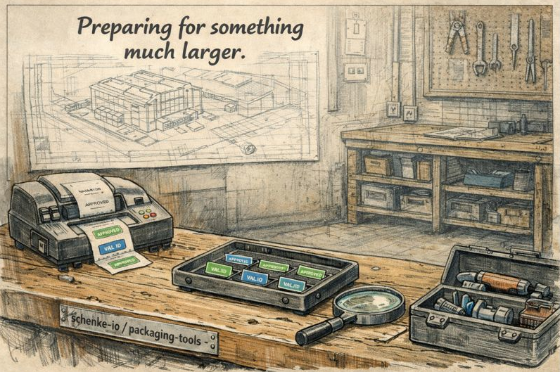

[](workbench/resources/md/svg/coverage.svg)
[](workbench/resources/md/svg/phpstan.svg)
[](https://packagist.org/packages/schenke-io/packaging-tools)
[](https://packagist.org/packages/schenke-io/packaging-tools)
[](https://github.com/schenke-io/packaging-tools/actions/workflows/run-tests.yml)
[](https://github.com/schenke-io/packaging-tools/blob/main/LICENSE.md)
[](https://packagist.org/packages/schenke-io/packaging-tools)

<!--
********************************************************************************
*                                                                              *
*     DO NOT EDIT THIS FILE MANUALLY! IT WILL BE OVERWRITTEN.                  *
*                                                                              *
*  This file was generated by:                                                 *
*  workbench/MakeMarkdown.php
*  Source files are located in: workbench/resources/md
*                                                                              *
*     If you want to change the content, edit the source files instead.        *
*                                                                              *
********************************************************************************
-->
# <a name="packaging-tools"></a>Packaging Tools

> Tools to simplify publishing github packages



This package is a collection of tools to simplify the package and project development.

The main elements are:
- **Markdown** Assemble the readme.md file out of small markdown files, class comments and other sources
- **Badge** build the badge custom or from existing files
- **Setup** read the `.packaging-tools.neon` configuration file and modify scripts in `composer.json`
- **Boost Skills & Guidelines** this package supports the [Laravel Boost](https://laravel.com/docs/12.x/boost) standard for AI-ready packages.

### <a name="skill-based-documentation"></a>Skill-based documentation

Documentation for this package is partly generated from **AI Skills**. These skills are small, focused pieces of documentation that describe specific features or workflows. They are located in `resources/boost/skills/` and are also compatible with Laravel Boost.

By using these skills, the package ensures that both human developers and AI assistants have clear, actionable instructions on how to use the provided tools.

* [Packaging Tools](#packaging-tools)
    * [Skill-based documentation](#skill-based-documentation)
  * [Badges](#badges)
    * [When to use this skill](#when-to-use-this-skill)
    * [Quick start](#quick-start)
    * [Auto-detected badge types](#auto-detected-badge-types)
    * [PHP API](#php-api)
    * [Badge styles](#badge-styles)
    * [Forge badge (requires explicit parameters)](#forge-badge-requires-explicit-parameters)
  * [AI Guidelines and Skills for Boost](#ai-guidelines-and-skills-for-boost)
    * [When to use this skill](#when-to-use-this-skill)
    * [AI Guidelines](#ai-guidelines)
      * [Example `core.blade.php`](#example-core-blade-php)
    * [AI Skills](#ai-skills)
      * [Example `SKILL.md`](#example-skill-md)
    * [Including skills in Markdown assembly](#including-skills-in-markdown-assembly)
  * [Database Migrations](#database-migrations)
    * [When to use this skill](#when-to-use-this-skill)
    * [Quick start](#quick-start)
    * [Configuration (`.packaging-tools.neon`)](#configuration-packaging-tools-neon)
    * [Process](#process)
    * [Workbench support](#workbench-support)
    * [Using the trait in an Artisan command](#using-the-trait-in-an-artisan-command)
  * [Markdown Assembler](#markdown-assembler)
    * [When to use this skill](#when-to-use-this-skill)
    * [Script location](#script-location)
    * [Minimal example](#minimal-example)
    * [Assembler methods](#assembler-methods)
    * [Badges: `badges()`](#badges-badges)
    * [Classes: `classes()`](#classes-classes)
    * [Tables: `tables()`](#tables-tables)
    * [Skills: `skills()`](#skills-skills)
    * [Table of Contents](#table-of-contents)
  * [Setup](#setup)
    * [When to use this skill](#when-to-use-this-skill)
    * [Installation](#installation)
    * [Commands](#commands)
    * [Configuration file: `.packaging-tools.neon`](#configuration-file-packaging-tools-neon)
    * [Configuration keys](#configuration-keys)
    * [Custom tasks](#custom-tasks)
    * [Concept](#concept)
  * [Speed Seeding](#speed-seeding)
    * [When to use this skill](#when-to-use-this-skill)
    * [How it works](#how-it-works)
    * [Usage](#usage)
    * [Generating the SQL dump](#generating-the-sql-dump)
    * [Important](#important)
    * [MarkdownAssembler](#markdownassembler)
      * [How to assemble a markdown](#how-to-assemble-a-markdown)
        * [Bootstrapping](#bootstrapping)
        * [Assembly Example](#assembly-example)
        * [Key Methods](#key-methods)
      * [Public methods of MarkdownAssembler](#public-methods-of-markdownassembler)
    * [MakeBadge](#makebadge)
      * [Public methods of MakeBadge](#public-methods-of-makebadge)
    * [Config](#config)
      * [Public methods of Config](#public-methods-of-config)

| Title                                                                                                      | Description                                                                      |
|------------------------------------------------------------------------------------------------------------|----------------------------------------------------------------------------------|
| [packaging-tools-badges](resources/boost/skills/packaging-tools-badges/SKILL.md)                           | Generate SVG badges for project metrics                                          |
| [packaging-tools-guidelines](resources/boost/skills/packaging-tools-guidelines/SKILL.md)                   | Write AI guidelines and skills for projects based on Laravel Boost standards     |
| [packaging-tools-imported-migrations](resources/boost/skills/packaging-tools-imported-migrations/SKILL.md) | Regenerate package migrations from a live database schema                        |
| [packaging-tools-markdown-assembly](resources/boost/skills/packaging-tools-markdown-assembly/SKILL.md)     | Assemble modular documentation and class references into a README                |
| [packaging-tools-setup](resources/boost/skills/packaging-tools-setup/SKILL.md)                             | Install, configure, and run packaging tools via composer scripts                 |
| [packaging-tools-speed-seeding](resources/boost/skills/packaging-tools-speed-seeding/SKILL.md)             | Speed up tests by loading a pre-generated SQL dump instead of running migrations |

## <a name="badges"></a>Badges

### <a name="when-to-use-this-skill"></a>When to use this skill
Use when you need to generate or update SVG badge files for a project's README, or when adding badge configuration to a Markdown assembler script.

### <a name="quick-start"></a>Quick start

Generate all auto-detected badges at once:

```bash
composer setup badges
```

This calls `MakeBadge::auto()`, which scans for known source files (clover.xml, phpstan.neon, infection-report.json, composer.json) and writes SVG files to `resources/md/svg/` (or `workbench/resources/md/svg/`).

### <a name="auto-detected-badge-types"></a>Auto-detected badge types

| Badge | Source | Detection |
|---|---|---|
| Coverage | clover.xml | path from phpunit.xml |
| PhpStan | phpstan.neon / phpstan.neon.dist | auto-discovered |
| Infection | infection-report.json | auto-discovered |
| PHP version | composer.json | `require.php` constraint |
| Latest version | composer.json | package name → Packagist |
| Downloads | composer.json | package name → Packagist |
| Laravel version | composer.json | `require.laravel/framework` |
| Tests | composer.json | GitHub repo → Actions |
| License | composer.json | `license` field |

### <a name="php-api"></a>PHP API

```php
use SchenkeIo\PackagingTools\Badges\MakeBadge;

// auto-generate all detected badges
MakeBadge::auto();

// generate specific badges (path optional, auto-detected when omitted)
MakeBadge::makeCoverageBadge();                          // from clover.xml
MakeBadge::makePhpStanBadge(color: '2563eb');            // blue by default
MakeBadge::makeInfectionBadge();
MakeBadge::makePhpVersionBadge();

// with explicit paths
MakeBadge::makeCoverageBadge('build/logs/clover.xml');
MakeBadge::makePhpStanBadge('phpstan.neon', '16a34a');

// custom badge
MakeBadge::define('My Label', 'passing', '27AE60')
    ->store('resources/md/svg/my-badge.svg');
```

`store()` signature: `store(?string $filepath = null, ?BadgeStyle $style = null)`. When `$filepath` is null, the badge is stored at `$markdownDir/svg/{subject-slug}.svg`.

### <a name="badge-styles"></a>Badge styles

```php
use SchenkeIo\PackagingTools\Enums\BadgeStyle;

BadgeStyle::Flat          // flat (default)
BadgeStyle::FlatSquare    // flat-square
BadgeStyle::Plastic       // plastic
BadgeStyle::ForTheBadge   // for-the-badge
```

### <a name="forge-badge-requires-explicit-parameters"></a>Forge badge (requires explicit parameters)

The Forge deployment badge is not auto-detected and must be added via the Markdown assembler:

```php
$assembler->badges()->forge(
    hash: 'your-hash',
    server: 123456,
    site: 654321,
    date: 1,   // 1 = show date, 0 = hide
    label: 1   // 1 = show label, 0 = hide
);
```

## <a name="ai-guidelines-and-skills-for-boost"></a>AI Guidelines and Skills for Boost

### <a name="when-to-use-this-skill"></a>When to use this skill
Use when creating or updating AI guidelines (`core.blade.php`) or skill files (`SKILL.md`) for a Laravel package so that Boost-compatible projects can load them automatically.

### <a name="ai-guidelines"></a>AI Guidelines

Add a `resources/boost/guidelines/core.blade.php` file to your package. When users run `php artisan boost:install`, Boost loads it automatically as AI context.

Guidelines should:
- Briefly describe what the package does
- List key conventions and file structures
- Show example commands and code snippets
- Be concise and actionable — written for AI, not humans

#### <a name="example-core-blade-php"></a>Example `core.blade.php`

```php
## vendor/package-name

This package provides [brief description].

### Features

- Feature 1: [description].
- Feature 2: [description]. Example:

```php
$result = PackageName::featureTwo($param1, $param2);
```
```

The `@verbatim` / `<code-snippet>` wrapper is processed by the Skills assembler into a plain fenced code block when included in Markdown output.

### <a name="ai-skills"></a>AI Skills

Add a `resources/boost/skills/{skill-name}/SKILL.md` file. Required frontmatter: `name` and `description`. The folder name is used as the skill identifier.

#### <a name="example-skill-md"></a>Example `SKILL.md`

```markdown
---
name: package-name-feature
description: Build and work with PackageName features.
---

## When to use this skill
Use when working with PackageName features...

## Features

- Feature 1: description.
- Feature 2: description. Example:

$result = PackageName::featureTwo($param1, $param2);
```

### <a name="including-skills-in-markdown-assembly"></a>Including skills in Markdown assembly

The `MarkdownAssembler` can embed skill content or render a summary table:

```php
use SchenkeIo\PackagingTools\Markdown\MarkdownAssembler;

$assembler = new MarkdownAssembler('resources/md');

// embed full content of all skills
$assembler->skills()->all();

// embed a specific skill
$assembler->skills()->add('my-skill-name');

// render a summary table (name + description) for all skills
$assembler->skillOverview();
```

`skillOverview()` generates a Markdown table with linked skill names and their descriptions, sourced from each SKILL.md's frontmatter.

## <a name="database-migrations"></a>Database Migrations

### <a name="when-to-use-this-skill"></a>When to use this skill
Use when you want to keep your package's migration files in sync with a development database. This is a "database-first" workflow: you modify the database manually, then regenerate the migrations from it.

Requires `kitloong/laravel-migrations-generator` to be installed.

### <a name="quick-start"></a>Quick start

```bash
composer migrations
```

This runs the full migration regeneration cycle: deletes old migrations, generates new ones from the configured database connection, then cleans environment-specific connection calls from the files.

### <a name="configuration-packaging-tools-neon"></a>Configuration (`.packaging-tools.neon`)

```neon
migrations: mysql:*
```

Format: `connection:tables` — use `*` to auto-detect tables from your Eloquent models.

Examples:
- `mysql:*` — use `mysql` connection, detect tables from models
- `sqlite:users,posts` — use `sqlite` connection, only those tables
- `null` — disable migration generation

### <a name="process"></a>Process

1. Checks that `kitloong/laravel-migrations-generator` is installed.
2. Reads the connection and table list from `.packaging-tools.neon`.
3. If `*` is used, scans for Eloquent models in (in priority order):
   - `workbench/app/Models`
   - `app/Models`
   - `src/Models`
4. Cleans the migrations folder.
5. Runs `migrate:generate` with `--skip-log --default-index-names --date=2020-10-10`.
6. Strips environment-specific `connection()` calls from generated files.
7. Sets generated files to read-only (mode 444) to prevent manual edits.

### <a name="workbench-support"></a>Workbench support

If `workbench/database/migrations` exists, it is used as the migration output path instead of `database/migrations`.

### <a name="using-the-trait-in-an-artisan-command"></a>Using the trait in an Artisan command

```php
use SchenkeIo\PackagingTools\Traits\GeneratesPackageMigrations;
use Illuminate\Console\Command;

class MyMigrationCommand extends Command
{
    use GeneratesPackageMigrations;

    public function handle(): void
    {
        $this->generatePackageMigrations();
    }
}
```

The trait must be used inside a class that extends `Illuminate\Console\Command` (it calls `$this->call()`). It reads `.packaging-tools.neon` automatically and performs the same steps as `composer migrations`.

## <a name="markdown-assembler"></a>Markdown Assembler

### <a name="when-to-use-this-skill"></a>When to use this skill
Use when building or editing the script that generates `README.md` from modular source files. The assembler compiles badges, markdown partials, class docs, tables, and a table of contents into a single output file.

### <a name="script-location"></a>Script location

The assembler script is auto-generated by `composer setup`. Depending on the project structure:

- **Package with workbench**: `workbench/app/Console/Commands/MakeMarkdown.php` (Laravel console command)
- **Standalone package**: `.make-markdown.php` (plain PHP script, run via `php .make-markdown.php`)

Initialize source markdown files (creates `resources/md/` with placeholder files):

```php
MarkdownAssembler::init('resources/md');
```

### <a name="minimal-example"></a>Minimal example

```php
use SchenkeIo\PackagingTools\Markdown\MarkdownAssembler;

$assembler = new MarkdownAssembler('resources/md');

$assembler
    ->addTableOfContents()
    ->addMarkdown('header.md')
    ->badges()->all()
    ->addMarkdown('installation.md')
    ->addMarkdown('usage.md')
    ->classes()->all()
    ->writeMarkdown('README.md');
```

`MarkdownAssembler` takes the markdown source directory as its first argument. All `addMarkdown()` paths are relative to that directory.

### <a name="assembler-methods"></a>Assembler methods

| Method | Purpose |
|---|---|
| `addTableOfContents()` | Inserts a linked TOC (auto-generated from all headings) |
| `addMarkdown(string $file)` | Includes a markdown file from the source directory |
| `addText(string $content)` | Inlines raw markdown text |
| `autoHeader(?string $title)` | Auto-generates title, description, cover image, and all badges |
| `skipWrittenBy()` | Omits the "DO NOT EDIT" header comment and footer |
| `image(string $alt, string $path, string $url)` | Adds a linked image |
| `addContentProvider(MarkdownPieceInterface $provider)` | Adds a custom content block |
| `writeMarkdown(string $filepath)` | Assembles and writes the final file |

### <a name="badges-badges"></a>Badges: `badges()`

```php
$assembler->badges()->all();                             // all auto-detected badges
$assembler->badges()->version(BadgeStyle::Flat);
$assembler->badges()->test('run-tests.yml');
$assembler->badges()->download(BadgeStyle::FlatSquare);
$assembler->badges()->php();
$assembler->badges()->local('My Badge', 'resources/md/svg/my-badge.svg');
$assembler->badges()->forge(hash: 'abc', server: 1, site: 2, date: 1, label: 1);
```

`all()` automatically includes local SVG badges from `$markdownDir/svg/` and remote badges (version, downloads, tests, php) detected from `composer.json`.

### <a name="classes-classes"></a>Classes: `classes()`

Documents PHP classes by extracting PHPDoc and method signatures:

```php
$assembler->classes()->all();                            // all classes in src/
$assembler->classes()->add(MyClass::class);              // single class
$assembler->classes()->glob('src/Models/*.php');         // glob pattern
$assembler->classes()->custom(MyClass::class, fn($data) => "## {$data->name}");
```

Only classes with `@markdown` in their PHPDoc or significant documentation are rendered.

### <a name="tables-tables"></a>Tables: `tables()`

```php
$assembler->tables()->fromFile('data/table.csv');
$assembler->tables()->fromCsvString($csv, ',');
$assembler->tables()->fromArray([['Col1', 'Col2'], ['a', 'b']]);
```

### <a name="skills-skills"></a>Skills: `skills()`

```php
$assembler->skills()->all();                             // all skills in resources/boost/skills/
$assembler->skills()->add('my-skill-name');              // specific skill
$assembler->skillOverview();                             // summary table (name + description)
```

### <a name="table-of-contents"></a>Table of Contents

The TOC is auto-built from all `#` headings across all assembled blocks. Use `addTableOfContents()` to place a placeholder; it is replaced with the full linked TOC at write time. Heading anchors (`<a name="...">`) are injected automatically.

## <a name="setup"></a>Setup

### <a name="when-to-use-this-skill"></a>When to use this skill
Use when installing the package for the first time, updating the configuration, or running any of the built-in task commands (`test`, `analyse`, `coverage`, `markdown`, etc.).

### <a name="installation"></a>Installation

```bash
composer require schenke-io/packaging-tools
```

Add the setup script to `composer.json`:

```json
{
    "scripts": {
        "setup": "SchenkeIo\\PackagingTools\\Setup::handle"
    }
}
```

### <a name="commands"></a>Commands

| Command | Action |
|---|---|
| `composer setup` | Show current config status and any pending changes |
| `composer setup config` | Create or sync `.packaging-tools.neon` |
| `composer setup update` | Apply pending composer.json script additions and install missing packages |
| `composer setup badges` | Generate all auto-detected SVG badges |
| `composer setup <task>` | Run a specific configured task (e.g., `test`, `pint`, `quick`) |

### <a name="configuration-file-packaging-tools-neon"></a>Configuration file: `.packaging-tools.neon`

```neon
analyse: true
coverage: true
infection: true
markdown: php .make-markdown.php
migrations: mysql:*
pint: true
test: pest
quick:
    - pint
    - test
    - markdown
release:
    - pint
    - analyse
    - coverage
    - infection
    - markdown
sql-cache: true
customTasks: {}
```

### <a name="configuration-keys"></a>Configuration keys

| Key | Type | Description |
|---|---|---|
| `analyse` | `bool` | PHPStan static analysis (auto-detects Larastan) |
| `coverage` | `bool` | Adds coverage flags to test run; requires `clover.xml` |
| `infection` | `bool` | Mutation testing via `infection/infection` |
| `markdown` | `string\|null` | Command to run the Markdown assembler script |
| `migrations` | `string\|null` | Migration regeneration: format `connection:tables` or `connection:*` |
| `pint` | `bool` | Code style with Laravel Pint |
| `test` | `string` | Test runner: `pest`, `phpunit`, or `''` to disable |
| `quick` | `array` | Task group for fast iteration (default: pint, test, markdown) |
| `release` | `array` | Task group for pre-release checks |
| `sql-cache` | `bool\|string\|null` | Dump SQLite DB to SQL file; `true` = `tests/Data/seeded.sql` |
| `customTasks` | `array` | Map of custom task names to shell commands or class names |

### <a name="custom-tasks"></a>Custom tasks

```neon
customTasks:
    lint: php -l src/
    my-task: App\Console\Commands\MyTask
```

Run with: `composer setup lint` or `composer setup my-task`.

### <a name="concept"></a>Concept

- Configuration is the single source of truth — editing `.packaging-tools.neon` controls everything.
- Manual edits to `composer.json` scripts are preserved; the tool warns before overwriting.
- `composer setup` (no args) shows a diff of what would change — it never modifies without an explicit subcommand.
- All keys define their own schema via `nette/schema`; invalid config produces a clear error with a "did you mean?" suggestion.

## <a name="speed-seeding"></a>Speed Seeding

### <a name="when-to-use-this-skill"></a>When to use this skill
Use in test suites where running full migrations and seeders on every test is too slow. Load a pre-generated SQL dump once per test run instead.

This is a companion to the `sql-cache` configuration key, which generates the dump.

### <a name="how-it-works"></a>How it works

1. **Generate the dump** — `sql-cache: true` in `.packaging-tools.neon` makes `composer setup` dump the current SQLite DB to `tests/Data/seeded.sql` (configurable path).
2. **Load in tests** — the `LoadsSeededSql` trait loads that dump on first access, detected by checking if the `users` table exists.

### <a name="usage"></a>Usage

```php
use SchenkeIo\PackagingTools\Traits\LoadsSeededSql;
use Illuminate\Foundation\Testing\DatabaseTransactions;
use Tests\TestCase;

class MyFeatureTest extends TestCase
{
    use DatabaseTransactions;  // wrap each test in a transaction — do NOT use RefreshDatabase
    use LoadsSeededSql;

    public function setUp(): void
    {
        parent::setUp();
        $this->loadSeededSql();           // default: tests/Data/seeded.sql
        // $this->loadSeededSql('tests/Data/custom.sql');   // custom path
    }
}
```

`loadSeededSql()` is a no-op if the `users` table already exists in the current connection, so it is safe to call in every test without redundant reloads.

### <a name="generating-the-sql-dump"></a>Generating the SQL dump

In `.packaging-tools.neon`:

```neon
sql-cache: true            # dumps to tests/Data/seeded.sql
# sql-cache: tests/Data/custom.sql   # custom path
# sql-cache: null          # disabled
```

To run migrations and then dump in one step, add `@sql-cache` as a step in a custom task:

```neon
customTasks:
    seed: "@sql-cache"
```

### <a name="important"></a>Important

- Use `DatabaseTransactions`, **not** `RefreshDatabase`. `RefreshDatabase` re-runs migrations and undoes the seeded state.
- The SQL file must be committed to the repository so CI can load it without running seeders.
- Regenerate the dump whenever your schema or seed data changes.

| key        | description                                                                                                  |
|------------|--------------------------------------------------------------------------------------------------------------|
| analyse    | false = disabled, true = enabled (uses phpstan/phpstan-phpunit or larastan/larastan)                         |
| coverage   | false = disabled, true = enabled (adds --coverage to the test runner)                                        |
| infection  | false = disabled, true = enabled (requires infection/infection)                                              |
| markdown   | null = disabled, string = enabled (command to assemble Markdown files)                                       |
| migrations | null = disabled, connection:* = auto-detect, connection:table1,table2 = enabled (with connection and tables) |
| pint       | false = disabled, true = enabled (uses laravel/pint)                                                         |
| quick      | an array of scripts to include in this group: pint, test, markdown                                           |
| release    | an array of scripts to include in this group: pint, analyse, test, coverage, infection, markdown             |
| sql-cache  | null = disabled, true = default path, 'path/to/file.sql' = custom path                                       |
| test       | '' = disabled, 'pest' or 'phpunit' = enabled                                                                 |

### <a name="markdownassembler"></a>MarkdownAssembler

Core engine for assembling Markdown documentation.


#### <a name="how-to-assemble-a-markdown"></a>How to assemble a markdown

To assemble a markdown you need:
- a directory with markdown source files (e.g., `workbench/resources/md`)
- an assembly script (e.g., `workbench/MakeMarkdown.php`)

The `MarkdownAssembler` helps you combine static markdown files with dynamically generated content like badges, tables, and class documentation.

##### <a name="bootstrapping"></a>Bootstrapping

You can initialize a markdown directory with standard files:

```php
use SchenkeIo\PackagingTools\Markdown\MarkdownAssembler;

MarkdownAssembler::init('workbench/resources/md');
```

##### <a name="assembly-example"></a>Assembly Example

```php
<?php

require "vendor/autoload.php";

use SchenkeIo\PackagingTools\Markdown\MarkdownAssembler;

try {
    $mda = new MarkdownAssembler('workbench/resources/md');

    // add a header with project name, description and badges
    $mda->autoHeader('My Awesome Package');

    // include a static file from the markdown directory
    $mda->addMarkdown("introduction.md");

    // add a Table of Contents for all headings in the final document
    $mda->toc();

    // add a table with all skills, their descriptions and links
    $mda->skillOverview();

    // add all skills from resources/boost/skills/
    $mda->skills()->all();

    // add a table from a CSV file
    $mda->tables()->fromFile('data.csv');

    // add documentation for all classes in src/
    $mda->classes()->all();

    // or from a single class
    $mda->classes()->add(MarkdownAssembler::class);

    // write the result to a file (relative to root directory)
    $mda->writeMarkdown("README.md");

} catch (Exception $e) {
    echo "ERROR: " . $e->getMessage() . PHP_EOL;
}
```

##### <a name="key-methods"></a>Key Methods

- `autoHeader(?string $title)`: Adds project title, description, and common badges.
- `addMarkdown(string $filename)`: Includes a file from the source directory.
- `addText(string $text)`: Appends raw markdown text.
- `toc()`: Inserts a Table of Contents.
- `skillOverview()`: Adds a table with all skills, their descriptions and links.
- `skills()`: Accesses the Skills piece for including feature documentation.
- `tables()`: Accesses the Tables piece for creating markdown tables from arrays, CSV strings, or files.
- `classes()`: Accesses the Classes piece for generating documentation from PHP classes using reflection.
- `badges()`: Accesses the Badges piece for adding custom badges.
- `writeMarkdown(string $filename)`: Finalizes and writes the assembled markdown to the specified path.

#### <a name="public-methods-of-markdownassembler"></a>Public methods of MarkdownAssembler

| method             | summary                                                    |
|--------------------|------------------------------------------------------------|
| init               | -                                                          |
| skipWrittenBy      | -                                                          |
| autoHeader         | -                                                          |
| addMarkdown        | Adds a markdown file.                                      |
| addTableOfContents | add a table of content for the full file                   |
| addText            | adds markdown text                                         |
| addContentProvider | -                                                          |
| badges             | -                                                          |
| classes            | -                                                          |
| tables             | -                                                          |
| toc                | -                                                          |
| skills             | -                                                          |
| skillOverview      | Add a table with all skills, their descriptions and links. |
| image              | -                                                          |
| writeMarkdown      | writes all added elements into one file                    |

### <a name="makebadge"></a>MakeBadge

Central class for generating and storing SVG badges.

#### <a name="public-methods-of-makebadge"></a>Public methods of MakeBadge

| method              | summary                                                                     |
|---------------------|-----------------------------------------------------------------------------|
| auto                | Automatically detect and generate all supported badge types.                |
| define              | Create a new MakeBadge instance with manual definitions.                    |
| fromDriver          | Create a new MakeBadge instance using a driver.                             |
| makeCoverageBadge   | Create a coverage badge from a clover.xml file.                             |
| makePhpStanBadge    | Create a PHPStan badge from a neon configuration file and a specific color. |
| makeInfectionBadge  | Create an Infection badge from a JSON report.                               |
| makePhpVersionBadge | Create a PHP version badge from composer.json.                              |
| info                | Get the informational summary string for the badge.                         |
| store               | Generate the SVG and store it in a file.                                    |

### <a name="config"></a>Config

Handles the configuration for the packaging tools.

#### <a name="public-methods-of-config"></a>Public methods of Config

| method          | summary                                                                  |
|-----------------|--------------------------------------------------------------------------|
| getMarkdownDir  | returns the directory where Markdown source files are located            |
| output          | outputs a message to the console unless silent mode is active            |
| doConfiguration | Entry point for configuration updates                                    |
| getC2pDeltas    | returns a list of deltas from composer.json to configuration             |
| writeConfig     | writes a default configuration file if it doesn't exist or merges deltas |


---

Markdown file generated by [schenke-io/packaging-tools](https://github.com/schenke-io/packaging-tools)
