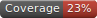

<!--

This file was written by 'MakeMarkdown.php' line 23 using
SchenkeIo\PackagingTools\Markdown\MarkdownAssembler

Do not edit manually as it will be overwritten.

-->
# Packaging Tools


[](https://packagist.org/packages/schenke-io/packaging-tools)
[](https://github.com/schenke-io/packaging-tools/actions/workflows/%3Arun-tests.yml%3Amain)
[](https://packagist.org/packages/schenke-io/packaging-tools)
[]()
[]()


[]()


This package is a collection of tools to simplify the package and project development.

The main elements are:
- **Markdown** Assemble the readme.md file out of small markdown files, class comments and other sources
- **Badge** build the badge custom or from existing files
- **Setup** read the `.packaging-tools.neon` configuration file and modify scripts in `composer.json`   


* [Packaging Tools](#packaging-tools)
  * [Installation](#installation)
  * [Concept](#concept)
  * [Configuration](#configuration)
  * [Classes](#classes)
    * [MarkdownAssembler](#markdownassembler)
      * [How to assemble a markdown](#how-to-assemble-a-markdown)
      * [Public methods of MarkdownAssembler](#public-methods-of-markdownassembler)
      * [Details of addTableFromFile()](#details-of-addtablefromfile())
      * [Details of addTableFromArray()](#details-of-addtablefromarray())
    * [MakeBadge](#makebadge)
      * [Public methods of MakeBadge](#public-methods-of-makebadge)
    * [ClassData](#classdata)


## Installation

Install the package with composer:

```bash
  composer require schenke-io/packaging-tools
```

Add the setup command into `composer.json` under scripts.

```json
{
    
    
    "scripts": {
        "setup": "SchenkeIo\\PackagingTools\\Setup::handle"    
    }
    
}

```


Start the setup:

```bash
  composer setup
```

and check all available setup parameters:

```bash
  composer setup help
```


## Concept

This package follows the following concept:
- setup and configuration is controlled by a config file
- manual edits have higher priority than automatics
- when manual edita would be overwritten there is a warning
- the documentation is organised out of components which get assembled at the end 
- important classes and methods are marked and documented
- badges are written from data 
- the build process is controlled by script
- missing files are explained with full path


## Configuration

Each package is controlled by a config file
`.packaging-tools.neon` . NEON files can be
written as YAML or JSON but additionally with comments.

The format can be easily schema verified and is used here as simple
key-value-pairs.


| key      | description                                                                          |
|----------|--------------------------------------------------------------------------------------|
| analyse  | true or false to control the use of PHPStan                                          |
| coverage | true or false to control the use of test coverage                                    |
| markdown | defaults to false, includes command to start the make file                           |
| pint     | true or false to control the use of Laravel Pint                                     |
| test     | defaults to 'pest', can be false or 'phpunit                                         |
| menu     | opens a console select for all commands in composer and in artisan commands if found |
| check    | group of scripts: pint, test, markdown                                               |
| release  | group of scripts: pint, analyse, coverage, markdown                                  |


## Classes


### MarkdownAssembler

Assembler of a markdown file


#### How to assemble a markdown

To assemble a markdown you need these things:
- a directory with well named markdown files
- documentation of classes and methods
- csv files for tables 
- a script
  - which writes badges
  - which read and assemble these files

This script can be a script run by php itself or 
a class file with a static method.


```php
<?php


require "vendor/autoload.php";

use SchenkeIo\PackagingTools\Markdown\MarkdownAssembler;

/*
 * this scripts make the package itself and tests its functionality
 */

try {
    $mda = new MarkdownAssembler(/* subdirectory for markdown include files */);
    $mda->addMarkdown(/* relative to markdown directory */);
    $mda->addTableOfContents();
    // relative to markdown directory
    $mda->addMarkdown("installation.md");
    // makes markdown from a class phpdoc
    $mda->addClassMarkdown(MarkdownAssembler::class);

    // path relative to root directory
    $mda->writeMarkdown("README.md");
} catch (Exception $e) {
    echo "ERROR: " . $e->getMessage() . PHP_EOL;
}


```

#### Public methods of MarkdownAssembler

| method                    | summary                                                                    |
|---------------------------|----------------------------------------------------------------------------|
| addMarkdown               | Adds a markdown file.                                                      |
| addTableOfContents        | add a table of content for the full file                                   |
| addText                   | adds markdown text                                                         |
| writeMarkdown             | writes all added elements into one file                                    |
| storeVersionBadge         | stores a version badge from packagist in the badge buffer                  |
| storeTestBadge            | stores a test badge from GitHub actions in the badge buffer                |
| storeDownloadBadge        | stores a download badge from packagist in the badge buffer                 |
| storeLocalBadge           | stores a local badge in the badge buffer                                   |
| storeForgeDeploymentBadge | stores a forge deployment badge from Laravel Forge in the badge buffer     |
| addLocalImage             | adds a link to a local image to markdown file                              |
| addBadges                 | adds all stored badges into the markdown file                              |
| addClassMarkdown          | Extracts documentation of a class in Markdown format                       |
| addClasses                | Uses a glob function to find many classes and extract their documentations |
| addCustomClassMarkdown    | adds a custom text using $callback(array $classData)                       |
| getClassData              | return the class documentation data as array                               |
| addTableFromFile          | read a csv file and converts it into a table                               |
| addTableFromCsvString     | takes a csv string and converts it into a table                            |
| addTableFromArray         | takes an array and converts it into a table                                |
#### Details of addTableFromFile()

The following extensions for the file are implemented: 

| Extension | Delimiter | Details             |
|-----------|-----------|---------------------|
| *.csv     | ,         | comma seperated     |
| *.psv     | \|        | pipe seperated      |
| *.tsv     | \t        | tabulator seperated |

#### Details of addTableFromArray()

The array is expected to have this format:

```php
$arary = [
    ['header 1','header 2','header 3'],
    ['cell 1:1','cell 1:2','cell 1:3'],
    ['cell 2:1','cell 2:2','cell 2:3'],
    ['cell 3:1','cell 3:2','cell 3:3'],
];

```

and would be rendered like this:

| header 1 | header 2 | header 3 |  
|----------|----------|----------|
| cell 1:1 | cell 1:2 | cell 1:3 |
| cell 2:1 | cell 2:2 | cell 2:3 |
| cell 3:1 | cell 3:2 | cell 3:3 |


### MakeBadge

makes badges in various formats and from many sources

#### Public methods of MakeBadge

| method            | summary                                                   |
|-------------------|-----------------------------------------------------------|
| define            | free definition of a badge with subject, status and color |
| makeCoverageBadge | makes a coverage badge from clover.xml                    |
| makePhpStanBadge  | makes a PHPStan badge from its config file                |
| store             | stores the badge in a given format in a svg file          |


### ClassData


